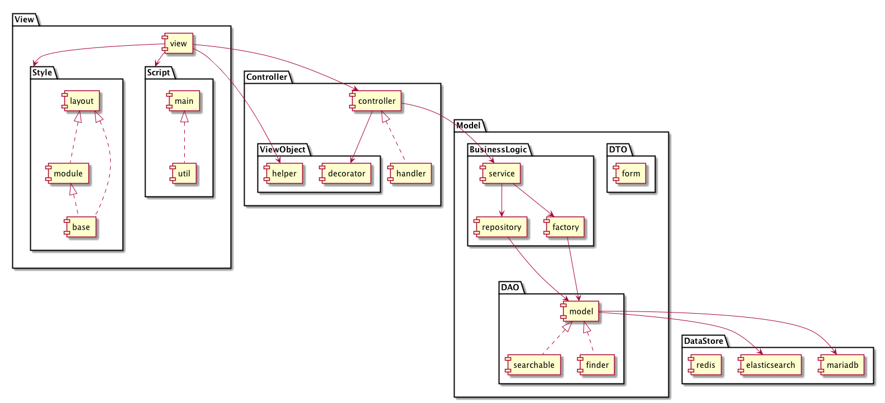

## My 100 Tales

This application manages your inspirations by save, edit, search.
So, my100tales grows your ideas in order to make dreams come true.



## Ruby version

## System dependencies

```
$ brew install node
$ npm install -g bower
```

## Configuration

```
$ bundle install --path vendor/bundle --without=production
$ bundle exec rake bower:install
```

## Database creation

set up MariaDB

```
$ docker build -t [image name] ./infrastructure/local/docker/mariadb/
$ docker run -d -p 3306:3306 -e MYSQL_ROOT_PASSWORD=[root password] [image name] \
    --name [container name] \
    --character-set-server=utf8mb4 \
    --collation-server=utf8mb4_unicode_ci \
    --innodb-file-format=Barracuda \
    --innodb-file-per-table=true \
    --innodb-large-prefix=true
```

create user

```
mysql> CREATE USER 'username'@'%' IDENTIFIED BY 'password';
mysql> GRANT ALL PRIVILEGES ON *.* TO 'username'@'%' WITH GRANT OPTION;
```

create scheme

```
mysql> CREATE DATABASE my100tales DEFAULT CHARSET utf8mb4;
```

create tables

```
$ DB_USERNAME=[username] DB_PASSWORD=[password] bundle exec rake db:migrate
```

## Database initialization

```
$ DB_USERNAME=[username] DB_PASSWORD=[password] bundle exec rake db:migrate:reset
```

## Key Value Store creation

```
$ docker build -t [image name] ./infrastructure/local/docker/redis/
$ docker run -d -p 6379:6379 --name [container name] [image name]
```

## Search engine creation

```
$ docker build -t [image name] ./infrastructure/local/docker/elasticsearch/
$ docker run -d -p 9200:9200 -p 9300:9300 --name [container name] [image name]
```

## Search engine initialization

```
$ DB_USERNAME=[username] DB_PASSWORD=[password] bundle exec rake elasticsearch:create_index
```

## Assets initialization

```
$ bundle exec rake emoji
```

## How to run the test suite

```
$ rake rubocop
$ rake rubocop:auto_correct
$ rubocop --auto-gen-config # => make source code better!
$ rails_best_practices # => make source code better!
```

## Services (job queues, cache servers, search engines, etc.)

- MariaDB
- Redis
- ElasticSearch

## Deployment instructions

```
$ DB_USERNAME=[username] DB_PASSWORD=[password] REDIS_DB=[db number] rails s
```
